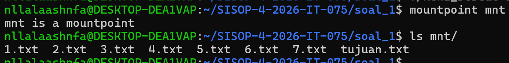
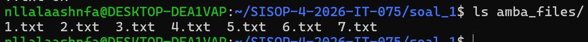
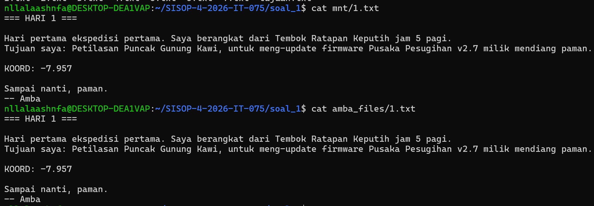
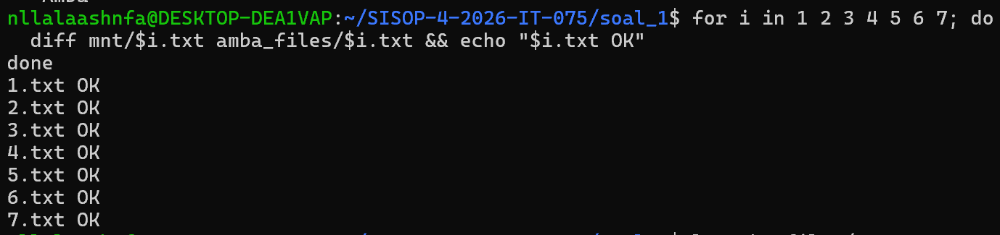
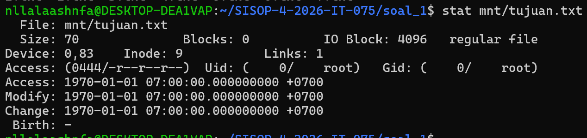
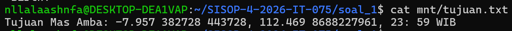
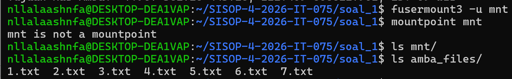
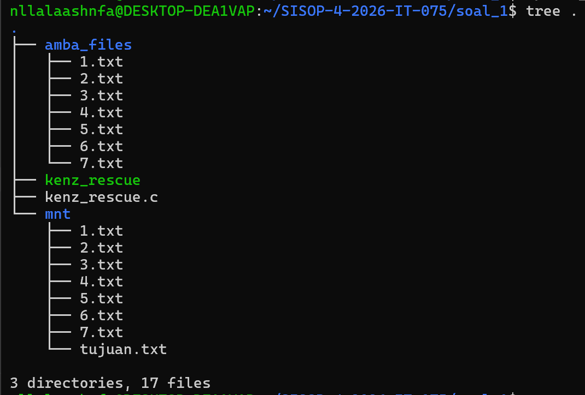

# SISOP-4-2026-IT-075

## Anggota

| Nama | NRP |
| ---- | --- |
| Nayla Aisha Hanifa | 5027251075 |

---

## Soal 1 — Save Asisten Kenz


### Penjelasan Soal

Sebastian menemukan sebuah flashdisk merah berisi 7 file teks (`1.txt` sampai `7.txt`). Setiap file punya satu baris yang diawali kata `KOORD:`, pecahan koordinat lokasi ritual tersebut yang harus digabungkan. Kalau semua fragmen sudah digabung berurutan, Sebastian bisa tahu lokasi Asisten Kenz

Tugasnya adalah membuat program FUSE bernama `kenz_rescue.c` yang bisa:
1. Me-*mount* folder `amba_files/` ke folder `mnt/` sehingga semua file di dalamnya bisa dibaca seperti biasa (*passthrough*, isi file sama persis dengan aslinya).
2. Menambahkan satu file "jadi-jadian" bernama `tujuan.txt` di dalam `mnt/` yang **tidak ada secara fisik** di `amba_files/`, tapi isinya otomatis dibikin saat dibuka dengan cara mengumpulkan semua baris `KOORD:` dari `1.txt` hingga `7.txt`.

---

### Penjelasan Kode

#### 1. Variabel Global `source_dir`

```c
static char source_dir[1000];
```

Variabel ini menyimpan path absolut folder sumber (misalnya `/home/user/amba_files`). Dipakai di hampir semua fungsi supaya tahu harus baca file dari mana.

---

#### 2. `resolve_path`, Mengubah Path FUSE ke Path Fisik

```c
void resolve_path(char *fpath, const char *path) {
    if (strcmp(path, "/") == 0) {
        sprintf(fpath, "%s", source_dir);
    } else {
        sprintf(fpath, "%s%s", source_dir, path);
    }
}
```

Ketika FUSE menerima path seperti `/1.txt`, sistem operasi sebenarnya tidak tahu file itu ada di mana secara fisik. Fungsi ini bertugas menerjemahkan path FUSE menjadi path nyata di disk.

Contoh: kalau `source_dir` adalah `/home/user/amba_files` dan FUSE meminta `/1.txt`, maka `fpath` akan diisi `/home/user/amba_files/1.txt`. Kalau path-nya `/` (root), langsung diisi dengan `source_dir` saja.

---

#### 3. `build_tujuan`, Pembuat Isi File Virtual `tujuan.txt`

```c
char *build_tujuan(size_t *out_len) {
    char fragments[2000] = {0};
    int first = 1;

    for (int i = 1; i <= 7; i++) {
        char filepath[1000];
        snprintf(filepath, sizeof(filepath), "%s/%d.txt", source_dir, i);

        FILE *f = fopen(filepath, "r");
        if (!f) continue;

        char line[500];
        while (fgets(line, sizeof(line), f)) {
            if (strncmp(line, "KOORD:", 6) == 0) {
                char *val = line + 6;
                while (*val == ' ') val++;
                int len = strlen(val);
                while (len > 0 && (val[len-1] == '\n' || val[len-1] == '\r' || val[len-1] == ' '))
                    val[--len] = '\0';
                if (!first) strncat(fragments, " ", sizeof(fragments) - strlen(fragments) - 1);
                strncat(fragments, val, sizeof(fragments) - strlen(fragments) - 1);
                first = 0;
            }
        }
        fclose(f);
    }

    char *content = NULL;
    int written = asprintf(&content, "Tujuan Mas Amba: %s\n", fragments);
    if (written < 0) return NULL;
    *out_len = (size_t)written;
    return content;
}
```

Cara kerjanya:

- Program membuka `1.txt`, `2.txt`, ..., `7.txt` **satu per satu secara berurutan**.
- Di setiap file, program membaca baris demi baris. Kalau ada baris yang dimulai dengan `KOORD:`, isi setelah kata itu diambil (spasi dan newline di awal/akhir dihapus dulu).
- Semua pecahan itu digabung jadi satu kalimat panjang, dipisahkan spasi.
- Hasilnya dibungkus jadi string: `Tujuan Mas Amba: <semua_fragmen_KOORD>\n`.

Fungsi ini tidak menyimpan hasilnya ke file, isi dibuat langsung di memori setiap kali ada yang baca `tujuan.txt`, makanya disebut *on-the-fly*.

---

#### 4. `xmp_getattr`, Memberi Informasi Metadata File

```c
static int xmp_getattr(const char *path, struct stat *stbuf) {
    memset(stbuf, 0, sizeof(struct stat));

    if (strcmp(path, "/tujuan.txt") == 0) {
        stbuf->st_mode  = S_IFREG | 0444;
        stbuf->st_nlink = 1;
        size_t len = 0;
        char *content = build_tujuan(&len);
        stbuf->st_size = (off_t)len;
        free(content);
        return 0;
    }

    char fpath[1000];
    resolve_path(fpath, path);
    int res = lstat(fpath, stbuf);
    if (res == -1) return -errno;
    return 0;
}
```

Setiap kali menjalankan perintah `stat` atau `ls -l`, sistem operasi memanggil fungsi ini untuk bertanya: "Berapa ukuran file ini? Apa permissionnya?"

Untuk `tujuan.txt`, karena file ini tidak ada secara fisik:
- `st_mode = S_IFREG | 0444` → ini file biasa, hanya bisa dibaca (read-only).
- `st_size` → ukurannya dihitung dari panjang string yang akan dihasilkan `build_tujuan`.

Untuk file lain (seperti `1.txt`, `2.txt`, dst.), cukup tanyakan langsung ke sistem via `lstat` di path fisiknya.

---

#### 5. `xmp_readdir`, Menampilkan Daftar Isi Folder

```c
static int xmp_readdir(const char *path, void *buf, fuse_fill_dir_t filler,
                        off_t offset, struct fuse_file_info *fi) {
    char fpath[1000];
    resolve_path(fpath, path);

    DIR *dp = opendir(fpath);
    if (dp == NULL) return -errno;

    struct dirent *de;
    filler(buf, ".", NULL, 0);
    filler(buf, "..", NULL, 0);

    while ((de = readdir(dp)) != NULL) {
        struct stat st;
        memset(&st, 0, sizeof(st));
        st.st_ino  = de->d_ino;
        st.st_mode = de->d_type << 12;
        filler(buf, de->d_name, &st, 0);
    }
    closedir(dp);

    if (strcmp(path, "/") == 0) {
        filler(buf, "tujuan.txt", NULL, 0);
    }
    return 0;
}
```

Fungsi ini dipanggil saat menjalankan `ls mnt/`. Tugasnya adalah memberi tahu FUSE "file apa saja yang ada di folder ini".

Caranya: buka folder fisik di `amba_files/`, baca semua entri yang ada (`.`, `..`, `1.txt`, `2.txt`, dst.), masukkan semuanya ke buffer FUSE via `filler`. Setelah semua file fisik dimasukkan, **tambahkan secara manual** entri `tujuan.txt`, inilah kenapa `ls mnt/` menampilkan 8 entri sedangkan `ls amba_files/` hanya 7.

---

#### 6. `xmp_open`, Membuka File

```c
static int xmp_open(const char *path, struct fuse_file_info *fi) {
    if (strcmp(path, "/tujuan.txt") == 0) {
        if ((fi->flags & O_ACCMODE) != O_RDONLY)
            return -EACCES;
        return 0;
    }

    char fpath[1000];
    resolve_path(fpath, path);
    int fd = open(fpath, fi->flags);
    if (fd == -1) return -errno;
    close(fd);
    return 0;
}
```

Fungsi ini dipanggil saat ada program yang mencoba membuka file (misalnya perintah `cat`).

Untuk `tujuan.txt`, kita pastikan file ini hanya boleh dibuka dengan mode baca saja. Kalau ada yang mencoba membukanya untuk ditulis, langsung ditolak dengan error `EACCES` (permission denied). Untuk file lain, langsung diteruskan ke sistem operasi seperti biasa.

---

#### 7. `xmp_read`, Membaca Isi File

```c
static int xmp_read(const char *path, char *buf, size_t size,
                    off_t offset, struct fuse_file_info *fi) {
    if (strcmp(path, "/tujuan.txt") == 0) {
        size_t len = 0;
        char *content = build_tujuan(&len);
        if (!content) return -ENOMEM;

        if ((size_t)offset >= len) {
            free(content);
            return 0;
        }
        size_t to_copy = len - (size_t)offset;
        if (to_copy > size) to_copy = size;
        memcpy(buf, content + offset, to_copy);
        free(content);
        return (int)to_copy;
    }

    char fpath[1000];
    resolve_path(fpath, path);
    int fd = open(fpath, O_RDONLY);
    if (fd == -1) return -errno;
    int res = pread(fd, buf, size, offset);
    if (res == -1) res = -errno;
    close(fd);
    return res;
}
```

Ini yang dipanggil saat `cat mnt/tujuan.txt` dijalankan, sistem operasi meminta isi file.

Untuk `tujuan.txt`: panggil `build_tujuan` untuk membuat isinya di memori, lalu salin ke buffer `buf` sesuai ukuran dan posisi offset yang diminta. Setelah selesai, memori yang dipakai langsung dibebaskan (`free`).

Untuk file lain: buka file fisik di `amba_files/` lalu baca isinya langsung menggunakan `pread`, ini yang membuat passthrough terjadi.

---

#### 8. Registrasi Operasi FUSE

```c
static struct fuse_operations xmp_oper = {
    .getattr = xmp_getattr,
    .readdir = xmp_readdir,
    .open    = xmp_open,
    .read    = xmp_read,
};
```

Di sini kita mendaftarkan keempat fungsi callback tadi ke FUSE. Setiap kali sistem operasi butuh melakukan operasi di mount point, FUSE akan memanggil fungsi yang terdaftar di sini.

---

#### 9. `main`, Titik Masuk Program

```c
int main(int argc, char *argv[]) {
    if (argc < 3) {
        fprintf(stderr, "Usage: %s <source_directory> <mount_directory>\n", argv[0]);
        return 1;
    }

    if (realpath(argv[1], source_dir) == NULL) {
        perror("realpath");
        return 1;
    }

    char *fuse_argv[argc];
    fuse_argv[0] = argv[0];
    fuse_argv[1] = argv[2];
    for (int i = 3; i < argc; i++) fuse_argv[i - 1] = argv[i];
    int fuse_argc = argc - 1;

    umask(0);
    return fuse_main(fuse_argc, fuse_argv, &xmp_oper, NULL);
}
```

Program dijalankan dengan dua argumen: folder sumber dan folder mount. Misalnya: `./kenz_rescue amba_files mnt`.

- `realpath` mengubah path relatif `amba_files` menjadi path absolut dan menyimpannya ke `source_dir`.
- Karena FUSE hanya mengenal satu argumen posisional (mount point), argumen `source_dir` dihapus dari daftar argumen sebelum diteruskan ke `fuse_main`.
- `umask(0)` memastikan permission file tidak ikut-ikutan dimodifikasi oleh mask default sistem.
- `fuse_main` adalah fungsi dari library FUSE yang menjalankan filesystem kita.

---

### Cara Menjalankan

```bash
# 1. Masukkan dulu filenya 
cp "/mnt/c/Users/user/Downloads/amba_files.zip" .

# 2. Unzip dulu filenya
unzip amba_files.zip

# 3. Jika sudah diunzip, langsung hapus file aslinya sesuai permintaan soal
rm amba_files.zip

# 4. Buat folder mount 
mkdir mnt


# 5. Compile programnya
gcc -Wall -o kenz_rescue kenz_rescue.c $(pkg-config --cflags --libs fuse)
./kenz_rescue amba_files mnt

# 6. Baca file passthrough — harus sama persis dengan aslinya
cat mnt/1.txt
cat amba_files/1.txt

# 7. Baca file virtual
cat mnt/tujuan.txt

# 8. Unmount setelah selesai
fusermount3 -u mnt
```

---

### Output

1. Cek isi file mnt dan amba_files



2. Hasil output dengan memanggil 
```
cat mnt/1.txt
```
identik dengan output saat memanggil 
```
cat amba_files/1.txt
```


3. Membuktikan bahwa "OK" berarti passthrough berhasil: setiap file di mount
byte-identical sama source-nya
```
for i in 1 2 3 4 5 6 7; do
  diff mnt/$i.txt amba_files/$i.txt && echo "$i.txt OK"
done
```


4. memanggil stat untuk membuktikan bahwa tujuan.txt adalah file virtual yang dibuat on-the-fly, dibuktikan dengan Blocks: 0 (tidak ada data fisik di disk), timestamp 1970-01-01 (tidak punya waktu modifikasi nyata), dan permission 0444 (read-only).
```
stat mnt/tujuan.txt
```


5. TEMUKAN KOORDINAT RITUAL
```
cat mnt/tujuan.txt
```


6. saat program diunmount



---
### STRUKTUR AKHIR PROGRM


---

### Kendala

Tidak ada kendala.